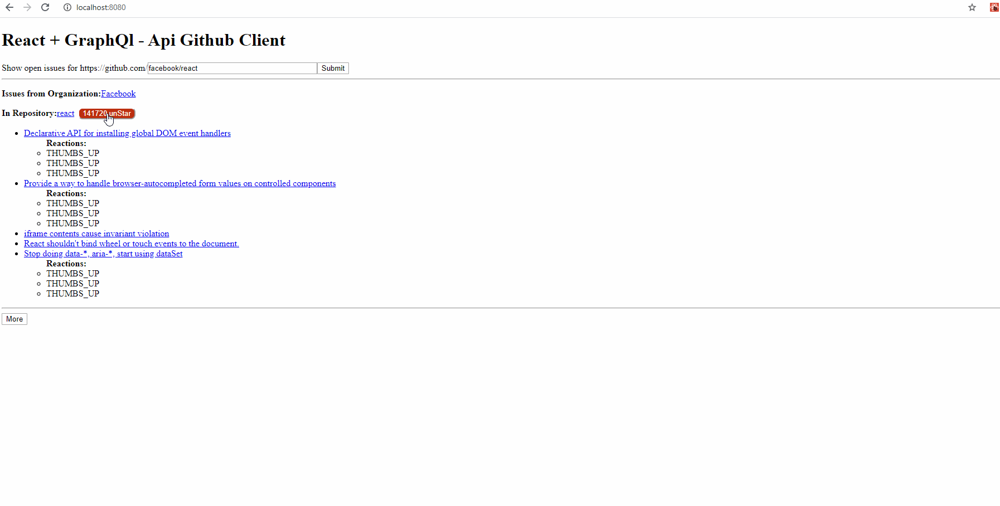

# react_graphql_github_client

Issue tracker web app that takes the name of organization and repository from the input field and displays all issues, reactions associated to it.
This application isn't feature complete nor does it cover all edge cases, neither is it styled. It is basically an implmentation using GraphQl without graphql client libraries like Apollo or Relay
React & graphql api implementation using github's graphql. Queries, mutation, and pagination are the primary features.

